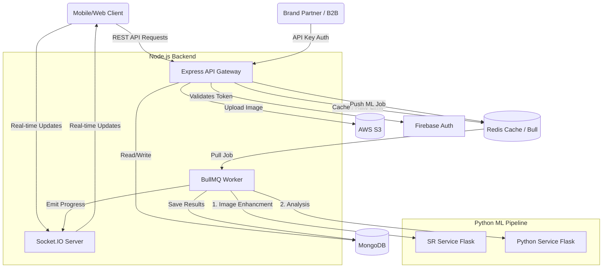
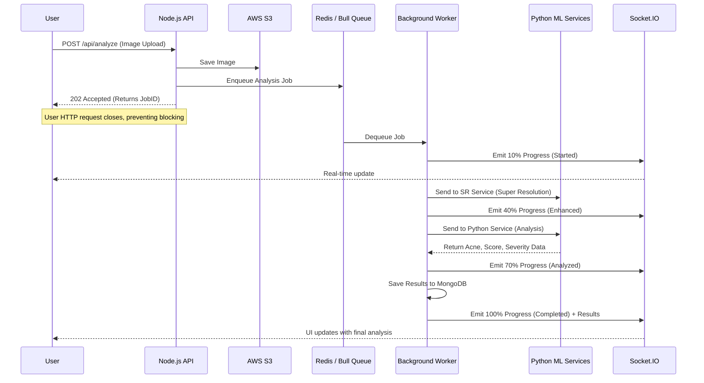
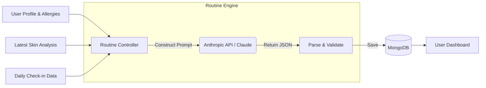
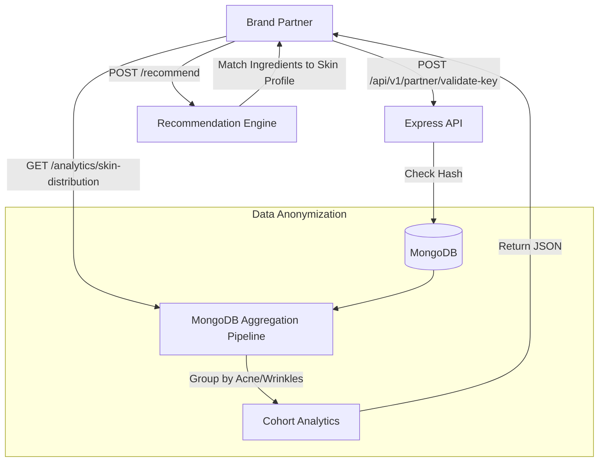

# SkinWise: Comprehensive Skin Health Analysis Platform

SkinWise is a full-stack skin health analysis platform that leverages computer vision and machine learning to analyze facial skin conditions, including acne, blackheads, wrinkles, and pigmentation, providing users with personalized skincare routines.

## 🌟 Features
- **Facial Skin Analysis:** Uses a custom-trained YOLOv5 model for acne detection and MediaPipe for facial landmark extraction.
- **Image Enhancement:** Includes an advanced Super Resolution service (GFPGAN/RealESRGAN) to upscale and enhance facial images for more accurate analysis.
- **Personalized Routines:** Generates customized skincare routines based on analysis results.
- **Dashboard & Profiles:** Track analysis history and routine streaks over time.

## 🛠️ Technology Stack
- **Frontend:** React, Vite, TailwindCSS, Zustand, React Query
- **Backend:** Node.js, Express, MongoDB, Redis, Firebase Admin, Bull (for background jobs)
- **ML Services:** Python, Flask, YOLOv5, MediaPipe, OpenCV
- **Super Resolution:** Python, Flask, GFPGAN, RealESRGAN
- **Infrastructure:** Docker, Docker Compose, Nginx

## 🚀 Getting Started

You can run SkinWise either using Docker (Recommended) or by running the services individually.

### Prerequisites
- [Docker & Docker Compose](https://www.docker.com/) (For Docker setup)
- [Node.js](https://nodejs.org/) (v18+ recommended)
- [Python](https://www.python.org/) (3.9+ recommended)
- MongoDB & Redis (if running locally without Docker)

### 1. Clone the repository
```bash
git clone <repository-url>
cd <repository-directory>
```

### 2. Environment Variables Setup
You will need to set up your `.env` files. You can use the `.env.example` files as a guide.
Ensure you have the appropriate `.env` files created and populated in:
- `/` (Root directory - for Docker Compose)
- `/frontend`
- `/backend`

*Note: You will need Firebase credentials, a MongoDB URI, and a Redis URL properly configured to use all features locally without Docker.*

### 3. Running with Docker (Recommended)
This is the easiest way to start all interconnected services simultaneously (Frontend, Backend, ML Service, SR Service, DBs, and Nginx).

```bash
# In the root directory
docker-compose up --build
```
Once the containers are successfully running, the application will be accessible via your browser.

### 4. Running Services Individually (Local Development)

If you prefer to run services manually for active development:

**Frontend:**
```bash
cd frontend
npm install
npm run dev
```

**Backend:**
```bash
cd backend
npm install
npm run dev
```
*(Requires MongoDB and Redis to be running locally or externally accessible)*

**Python ML Service:**
```bash
cd python_service
pip install -r requirements.txt
python app.py
```

**Super Resolution (SR) Service:**
```bash
cd sr_service
pip install -r requirements.txt
python app.py
```

## 📊 SkinWise Architecture & Data Flow Diagrams

Here are some architecture diagrams to help you understand the internal working and features of the SkinWise project.

---

### 1. High-Level System Architecture
This diagram shows all the services running in the SkinWise ecosystem and how they interact.



---

### 2. The Asynchronous ML Inference Pipeline
This sequence diagram shows the non-blocking asynchronous analysis workflow.



---

### 3. Skincare Routine Generation Flow
This diagram shows how user data and analysis results are fed into the LLM to generate personalized routines.



---

### 4. B2B Brand Partner Ecosystem
This diagram illustrates the multi-tenancy and data aggregation features built for skincare brands.


